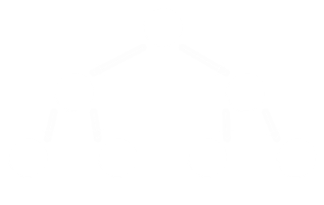
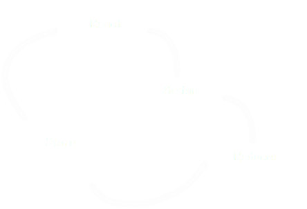

# React: Crash Course

---

1. Thinking in React
1. React
1. State Management
1. Async Actions

---

# Thinking in React
1. **Cohesion**: Increase cohesion, decrease coupling.
1. **Data Flow**: All data flows in one direction.

---

# Thinking in React
## Cohesion

- Features first, types second.
- Easy to package.

---

# Thinking in React
## Cohesion

```
src/
|__ Form/
    |__ Input/
    |   |__ Input.js
    |   |__ Input.styles.css
    |   |__ index.js
    |__ Button/
    |__ Form.js
    |__ index.js
```

---

# Thinking in React
## Data Flow

- All data flows downwards.
- There is no<sup>*</sup> way to pass information upwards.

---

# Thinking in React
## Data Flow



### Component Tree

---

# React

---

# React
## Cohesion

Increase cohesion between related HTML and JS.

```javascript
// Button.js
function Button(props) {
  return (
    <button onClick={handleOnClick}>{props.callToAction}</button>
  )
}

function handleOnClick() {
  console.log('clicked!');
}
```

^ JSX is how we get HTML in our JS

---

# React
## Cohesion

```javascript
import btn from "./Button.styles";

function Button(props) {
  return (
    <button className={btn.primary}>{props.callToAction}</button>
  )
}
```

^ CSS Modules help make sure that primary is unique no matter where you put this component.
^ POST CSS has a feature to automatically reset between components so that you never have to worry about inheritance.

---

# React
## Data Flow

`props` are the arguments passed to a component from the component above it.

```javascript
function MyForm(props) {
  return(
    // ...
    <Button callToAction="Click here!" />
  )
}
```

^ Introduce the idea of the component tree

---

# State Management

---

# State Management
## Data Flow



^ View (React)
^ Dispatch an Action
^ Reducers manipulate the state in Store
^ Re-render -> View
^ Talk about how we don't mutate and performance

---

# State Management
## Data Flow

```javascript
import { inputReducer } from 'components/Form/Input'

const store = createStore({
  input: inputReducer,  
})
```

^ The store is just a plain JavaScript object with special functions as values
^ Also: remember index.js? that's how we define a public API for our components.

---

# State Management
## Data Flow

```javascript
export function inputReducer(state, action) {
  switch (action.type) {
    case INPUT_CHANGE:
      return {
        value: action.value,
        ...state,
      }
    default:
      return state;
  }
}
```

---

# State Management
## Data Flow

```javascript
// Input.actions.js
const INPUT_CHANGE = 'INPUT_CHANGE';

export function handleChange(event) {
  return {
    type: INPUT_CHANGE,
    value: event.target.value,
  }
}
```

---

# State Management
## Data Flow

```javascript
// Input.js
import { handleChange } from './actions';

function Input(props) {
  return (
    <input onChange={(event) => handleOnChange(event)}></input>
  )
}

function mapDispatchToProps(dispatch) {
  return({
    handleOnChange: (event) => {
      dispatch(handleChange(event));
    }
  })
}

export default connect(mapStateToProps)(Input)
```

---

# State Management
## Cohesion

```
src/
|__ components/
|   |__ Form/
|       |__ Input/
|       |__ Form.js
|       |__ Form.actions.js
|       |__ Form.reducers.js
|       |__ index.js
|__ store.js
|__ index.js
```

^ We put everything together that is related to a feature.
^ Note the global store.

---

# State Management
## Cohesion

Q: How do components talk to each other?
A: Actions!

---

# State Management
## Cohesion

```javascript
// Input.js
import { handleChange } from '../components/OtherComponent';

function Input(props) {
  // ...
}

function mapDispatchToProps(dispatch) {
  return({
    hadleOnChange: (event) => {
      dispatch(handleChange(event));
    }
  })
}
```

---

# State Management
## Cohesion

Sagas to the rescue!

```javascript
// formAndOtherComponentSagas.js

function* someSagaName() {
  while (true) {
    const payload = yield take('INPUT_CHANGE')
    put({
      type: 'SOME_OTHER_COMPONENT_ACTION',
      data: payload.data,
    })
  }
}
```

---

# State Management
## Cohesion

```
src/
|__ sagas/
|__ components/
|   |__ Form/
|       |__ Input/
|       |__ Form.js
|       |__ Form.actions.js
|       |__ Form.reducers.js
|       |__ index.js
|__ store.js
|__ index.js
```

---

# Async Actions

^ sagas and remote, doing fetch, success/fail

---

# Async Actions
## Data Flow

---

# Next Steps

- GraphQL & Apolo

^ Components can declare what data they want. GraphQL will handle the fetching. Apolo will make sure it only fetches data that we don't alreay have locally.
^ Apolo query batching
